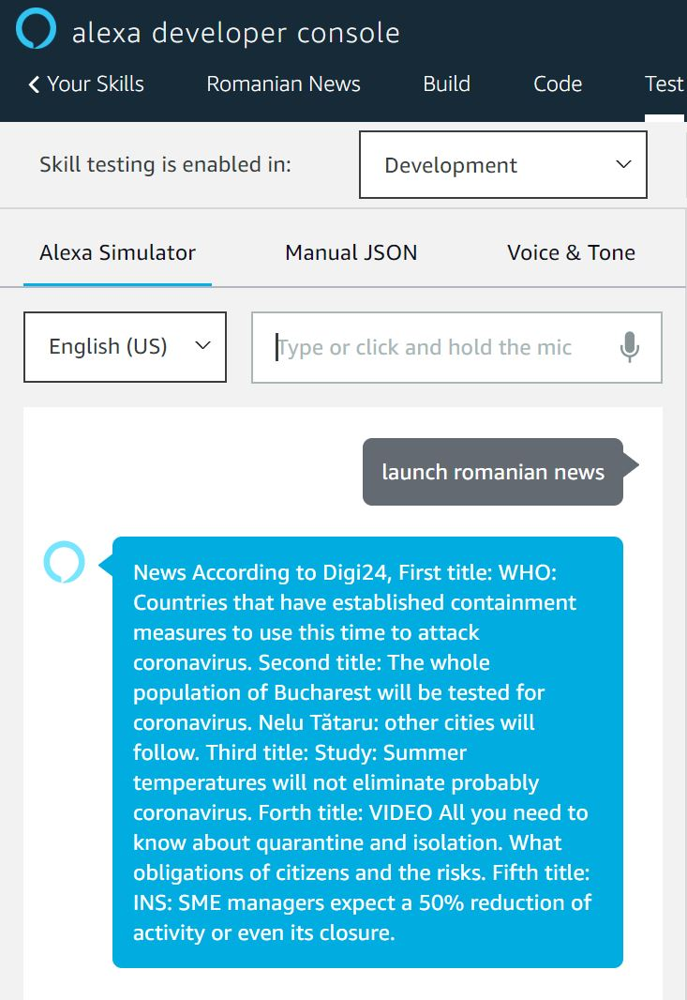

# Romanian News
### Main idea

There is no skill for Alexa for telling me the news in Romania so I implemented one using web scraping and after translating the results.

### Implementation

The skill was made in python and the news are gathered from https://www.digi24.ro/stiri/actualitate. In order to extract the titles I used beautifulsoup4  and after that I translated them from romanian to english using googletrans package (beacuse Amazon Alexa does not support romanian language at the moment).

Notes:
For any additional information, contact me at horigovor96@gmail.com
